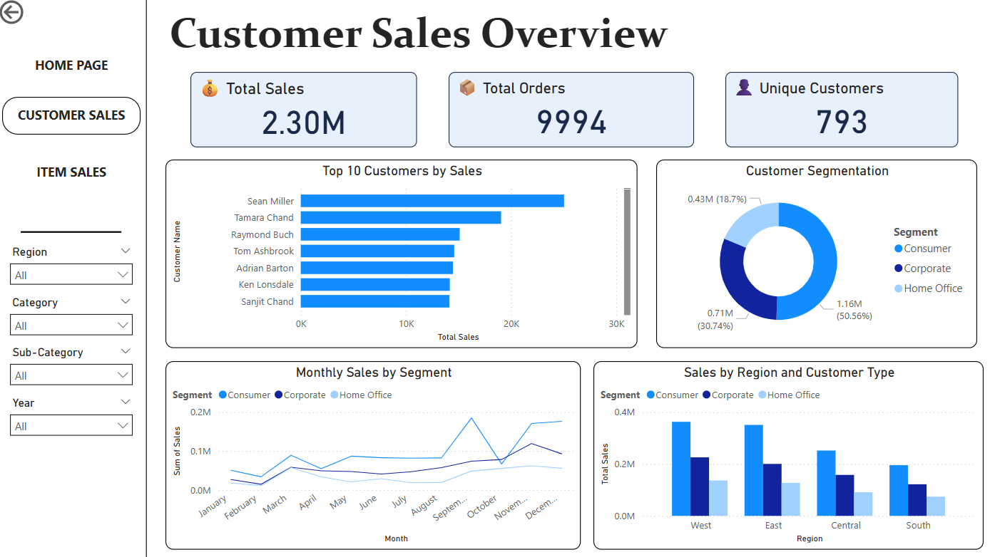
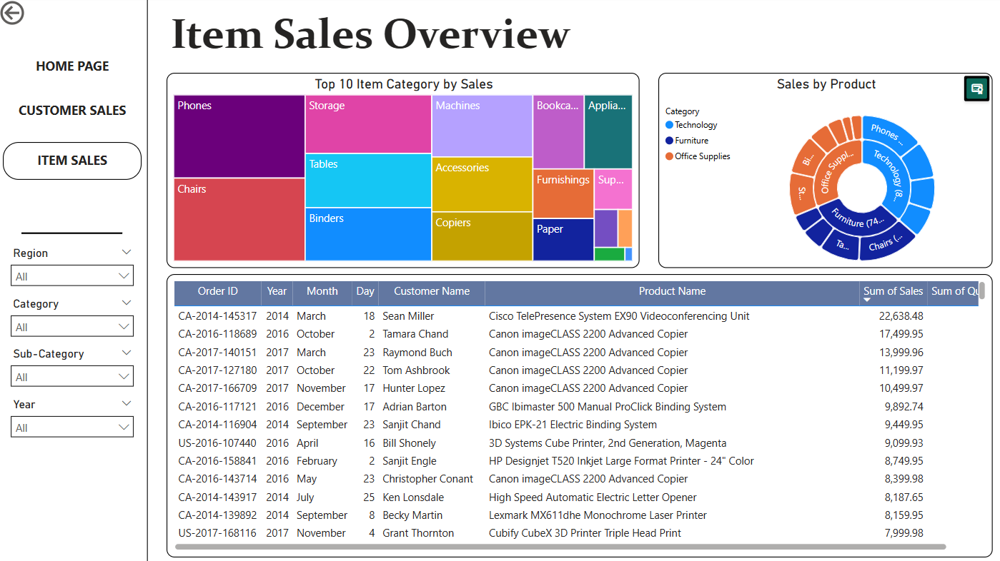

# 📊 E-Commerce Sales Dashboard (Power BI)

This Power BI project provides a complete data visualization solution using the [Superstore Dataset](https://www.kaggle.com/datasets/vivek468/superstore-dataset-final). The dashboard allows stakeholders to analyze overall performance, customer behavior, product sales, and category trends to make data-driven business decisions.

---

## 📁 Pages Overview

### 🏠 Home Page
An at-a-glance summary of key e-commerce metrics:
- **Total Orders, Sales, Profit, and Avg Order Value**
- **Monthly Sales Trend**
- **Sales Distribution by Product Category**
- **Sales Performance by State (Map)**
- **Sales Volume by Product Sub-Category**

---

### 👤 Customer Sales Overview
Focused on customer behavior and segmentation:
- **Total Sales, Orders, Unique Customers (KPI Cards)**
- **Top 10 Customers by Total Sales**
- **Customer Segmentation (Consumer, Corporate, Home Office)**
- **Monthly Sales Trend by Segment**
- **Sales by Region and Segment**

---

### 📦 Item Sales Overview
Product-centric breakdown of item performance:
- **Top Item Categories by Sales (Treemap)**
- **Hierarchical Product Breakdown (Sunburst Visual)**
- **Interactive Filters: Region, Category, Sub-Category, Year**
- **Detailed Transaction Table with Customer and Product Info**

---

## 📌 Key Features
- 💡 Clear KPI indicators with icon-enhanced visuals
- 📅 Monthly and yearly trend analysis
- 🧭 Regional and product-based segmentation
- 🗂 Hierarchical drill-down into categories and products
- 🌍 Geographic map visualization
- 🧾 Interactive slicers for deep filtering

---

## 📂 Files Included
| File | Description |
|------|-------------|
| `E-Commerce_Sales_Dashboard.pbix` | Power BI report file |
| `Superstore_Dataset.csv` | Raw dataset used in analysis |
| `/images/` | Preview screenshots for GitHub |

---

## 🛠 Tools Used
- Microsoft Power BI
- DAX (for calculated columns and measures)
- Treemap, Sunburst, Maps, Donut Charts, and Tables
- Superstore Dataset (via Kaggle)

---

## 📸 Preview

### Home Page  

### Customer Sales  

### Item Sales  

---

## 📊 Dataset Description
- **Source**: [Superstore Dataset - Kaggle](https://www.kaggle.com/datasets/vivek468/superstore-dataset-final)
- Includes: Order details, Product info, Region, Category, Customer Segment, Sales, Profit, Quantity, and Discount.

---

## 🧠 Goal
To help stakeholders:
- Identify top-performing products and customers
- Understand market trends and regional differences
- Support sales strategy decisions with data

---

## 🏷️ Tags
`powerbi` `superstore-dataset` `data-visualization` `sales-dashboard` `customer-insight` `business-intelligence`

---

## 📜 Acknowledgements
This dataset was originally sourced from Tableau and published on Kaggle for public educational use. All visualizations were built using Power BI.

